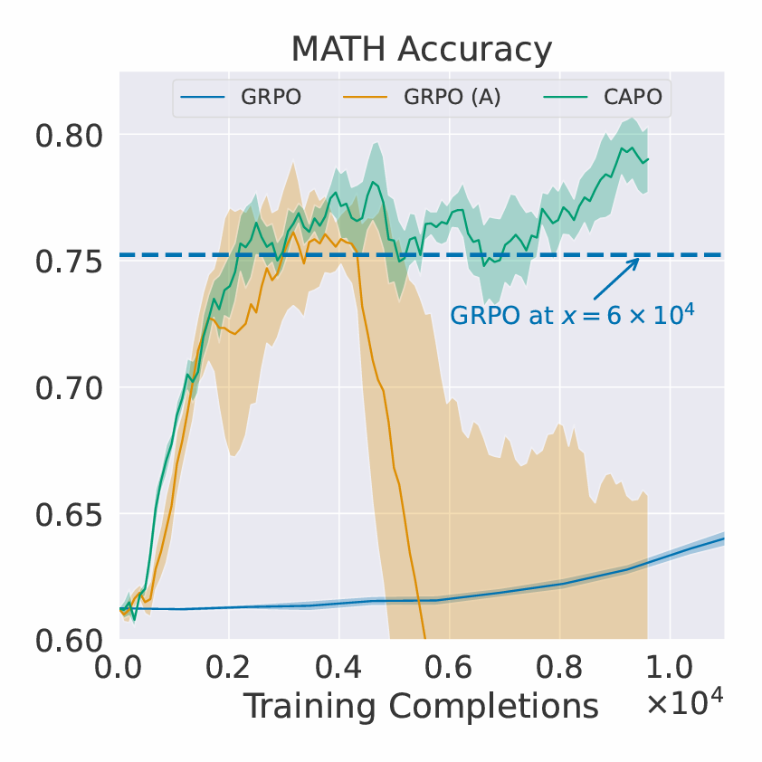
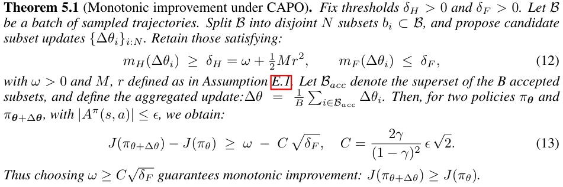
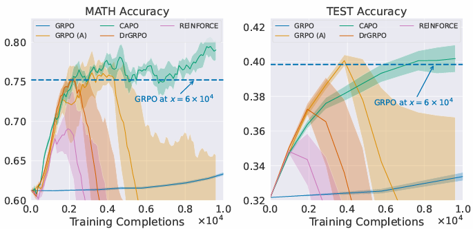
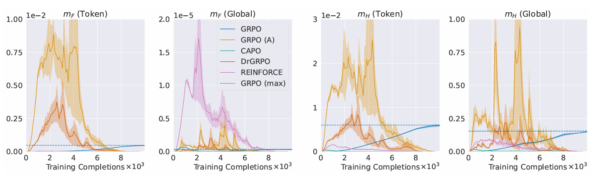

# Stabilizing Policy Gradients for Sample-Efficient RL in LLM Reasoning

[](https://arxiv.org/abs/2510.00819)

Official implementation of **Curvature-Aware Policy Optimization (CAPO)** from:

> **Stabilizing Policy Gradients for Sample-Efficient Reinforcement Learning in LLM Reasoning**  
> Luckeciano C. Melo, Alessandro Abate, Yarin Gal  
> ICLR 2026

---

## 🧠 Overview

Reinforcement Learning (RL), particularly policy gradient methods, is central to enabling reasoning in large language models (LLMs). However, these methods often suffer from **instability during optimization**, forcing practitioners to use conservative hyperparameters and large amounts of data.

This repository implements **CAPO (Curvature-Aware Policy Optimization)**, a method that:

- Models **second-order optimization geometry** (Hessian + Fisher information)
- Tracks **gradient and curvature dynamics** during training
- Identifies and removes samples that lead to unstable updates
- Enables **stable learning under aggressive update regimes**

CAPO achieves:
- Stable policy updates  
- Up to **30× improvement in sample efficiency**  
- Minimal intervention (<8% token rejection)


<p align="center">
  
</p>

*Figure 1: **Accuracy on MATH dataset from different RL methods.** CAPO (ours) achieves 30x greater sample efficiency under an aggressive (A) update regime (higher learning rate, smaller batch size), whereas GRPO suffers policy collapse.*

## 🚀 Key Idea

Instead of blindly applying policy gradient updates, CAPO:

1. Models optimization dynamics  
2. Predicts instability before updates  
3. Filters problematic samples  
4. Applies safer gradient steps  

This results in **monotonic policy improvement guarantees** under practical assumptions.

<p align="center">
  
</p>

---

## 📊 Results

CAPO significantly outperforms standard RL methods (e.g., GRPO):

- Prevents catastrophic policy collapse  
- Maintains stability in high learning rate regimes  
- Improves performance on math reasoning benchmarks  

<p align="center">
  
</p>

*Figure 2: **Comparison with baseline methods on policy gradient stability.** While the setup with more aggressive updates makes all methods more sample-efficient, it also leads the baselines to policy collapse. In contrast, CAPO prevents collapse and achieves up to 30x greater sample efficiency than GRPO under aggressive updates.*

<p align="center">
  
</p>

*Figure 13 **Evaluation of policy and objective shifts estimates from the proposed computational model during training.** Unstable methods exhibit large and abrupt directional curvatures, while stable ones maintain much smaller and smoother shifts. CAPO, by applying token-level bounds, also ensures well-behaved shifts at the global (batch) level, supporting the rationale of the Theorem above.*

---

## ⚙️ Installation

### Building the environment

Our code has been successfully tested on 4×80GB A100/H100 GPUs with CUDA 12.9. The following commands will create a Conda environment with all the required dependencies:

```bash
  conda env create -n capo
  conda activate capo
  pip install flash-attn==2.7.4.post1 --no-build-isolation
```

### Run the Code

We provide bash scripts for running our training and evaluation in SLURM-based clusters.

### 🏋️ Training
```bash
bash slurm/submit_job_sequence.sh <JOB_NAME> <MODEL> grpo <RECIPE> oatcloud zero2_oatcloud <GPU_TYPE> <NUM_SEEDS>
```

For reproducing the experiments in the paper, use the following recipes:

- GRPO: `standard_grpo`
- CAPO: `config_grpo_efficient_grpo_adam_fisher_mask_token_1e-4_hessian_mask_token_0.01`
- Dr.GRPO: `drgrpo_efficient_base`
- REINFORCE: `grpo_efficient_nobaseline_adam`
- Dr.CAPO: `config_drgrpo_efficient_adam_fisher_mask_token_1e-3_hessian_mask_token_5e-4`
- ReinCAPO: `config_grpo_efficient_nobaseline_adam_fisher_mask_token_1e-5_hessian_mask_token_0.1`

### 🧪 Evaluation
During evaluation, we cross-reference wandlogs and HF checkpoints. After evaluation, you will see eval metrics in the wandb logs.

```bash
bash submit_eval_jobs.sh <JOB_NAME> <MODEL> <FINAL_CHECKPOINT__STEP> <INITIAL_CHECKPOINT_STEP> <STEPS_INTERVAL> <WANDB_ENTITY> <WANDB_PROJECT> <WANDB_USER> <EXP_PREFIX> <TOTAL_SEQ_LENGTH> <GPU_TYPE>
```

---

## 🔬 Method Details

CAPO introduces a **curvature-aware optimization model** that:

- Approximates second-order structure of the RL objective  
- Monitors instability signals during training  
- Uses data selection as intervention  

This avoids unstable updates that commonly arise in:

- High-variance gradients  
- Non-stationary objectives  
- Large learning rates  

---

## 📚 Citation

```bibtex
@inproceedings{melo2026capo,
  title={Stabilizing Policy Gradients for Sample-Efficient Reinforcement Learning in LLM Reasoning},
  author={Melo, Luckeciano C. and Abate, Alessandro and Gal, Yarin},
  booktitle={ICLR},
  year={2026}
}
```

---

## ⭐️ Star this repo

If you find this useful, consider starring the repository.
